<!--
  Guru Kannan - GitHub Profile
  Live cards are refreshed by GitHub Actions every 30 minutes.
-->

<div align="center">



<br/>

[](https://git.io/typing-svg)

<a href="https://github.com/gurukannan22?tab=followers">
  
</a>
<a href="https://github.com/gurukannan22?tab=repositories">
  
</a>
<a href="https://komarev.com/ghpvc/?username=gurukannan22">
  
</a>
<a href="mailto:gurukannan0922@gmail.com">
  
</a>


<br/>

Modern backend systems, product dashboards, and teaching content with less noise and better spacing.

<a href="#live-dashboard">Live Dashboard</a> ·
<a href="#what-i-build">What I Build</a> ·
<a href="#tech-os">Tech OS</a> ·
<a href="#featured-work">Featured Work</a> ·
<a href="#connect">Connect</a>

</div>

---

## Live Dashboard

<div align="center">



</div>

<table cellspacing="0" cellpadding="0">
<tr>
<td width="48%" valign="top">



</td>
<td width="4%">&nbsp;</td>
<td width="48%" valign="top">


</td>
</tr>
</table>

<div align="center">

[](https://github.com/ashutosh00710/github-readme-activity-graph)

</div>

---

## What I Build

<table>
<tr>
<td width="50%" valign="top">

### Production Backends

I build Java and Spring Boot systems with authentication, service boundaries, database design, REST APIs, and event-driven flows that are meant to survive real users.

```java
record Stack(
    String backend,
    String messaging,
    String cloud,
    String principle
) {
    static Stack current() {
        return new Stack(
            "Java 17 + Spring Boot 3 + Security",
            "Kafka + Solace PubSub+",
            "AWS + Firebase + Docker",
            "Strong fundamentals scale better"
        );
    }
}
```

</td>
<td width="50%" valign="top">

### Learning Systems

I turn complex engineering topics into placement-focused roadmaps, live workshops, and project-based learning paths for Java, DSA, frontend, and full stack development.

```txt
now shipping:
  - CRM modules and invoice flows
  - Event-driven integration patterns
  - Java + DSA teaching tracks
  - AWS SAA preparation
```

</td>
</tr>
</table>

<div align="center">



</div>

---

## Tech OS

<table>
<tr>
<td width="33%" valign="top">

### Backend


</td>
<td width="33%" valign="top">

### Frontend


</td>
<td width="33%" valign="top">

### Cloud and Data


</td>
</tr>
</table>

<div align="center">

| Domain | Current Level | Active Focus |
|:---|:---:|:---|
| Java and Spring Boot | `█████████████░` 90% | Security, patterns, clean service design |
| React and Frontend | `███████████░░░` 76% | Component architecture and dashboard UX |
| SQL and Firestore | `███████████░░░` 74% | Schema design and query performance |
| Auth and Security | `██████████░░░░` 68% | JWT, OAuth2, Spring Security |
| AWS Cloud | `████████░░░░░░` 58% | SAA track, VPC, ECS, IAM, RDS |
| Event-Driven Systems | `████████░░░░░░` 55% | Kafka, Solace, DLQ, topic design |

</div>

---

## Featured Work

<div align="center">

<a href="https://github.com/gurukannan22/Java-Learning">
  
</a>
<a href="https://github.com/gurukannan22/frontend-learning">
  
</a>
<a href="https://github.com/gurukannan22/cybersecurity-learning">
  
</a>
<a href="https://github.com/gurukannan22/magic-link-service">
  
</a>

</div>

<table>
<tr>
<td width="33%" valign="top">

### CRM Engineering

Lead, finance, trainer, invoice, and reporting flows for Ednue platforms using React, Firebase, and Spring-oriented backend design.

</td>
<td width="33%" valign="top">

### Backend Security

Magic links, JWT flows, auth modules, and secure service boundaries with Spring Security and production-friendly API contracts.

</td>
<td width="33%" valign="top">

### Teaching Repos

Structured Java, frontend, cybersecurity, and full stack notes built for students who need clarity, repetition, and projects.

</td>
</tr>
</table>

---

## Deep Metrics

<div align="center">


<br/><br/>


</div>

---

## Contribution Trail

<div align="center">

<picture>
  <source media="(prefers-color-scheme: dark)" srcset="https://raw.githubusercontent.com/gurukannan22/gurukannan22/output/snake-dark.svg" />
  <source media="(prefers-color-scheme: light)" srcset="https://raw.githubusercontent.com/gurukannan22/gurukannan22/output/snake-light.svg" />
  
</picture>

</div>

---

## Connect

<div align="center">

<a href="https://linkedin.com/in/gurukannan0922">
  
</a>
<a href="https://github.com/gurukannan22">
  
</a>
<a href="mailto:gurukannan0922@gmail.com">
  
</a>

<br/><br/>

```txt
Open channels:
  - backend collaboration
  - Java / DSA mentoring
  - full stack project discussions
  - cloud and system design learning

Motto:
  Strong fundamentals scale better than shortcuts.
```


</div>
